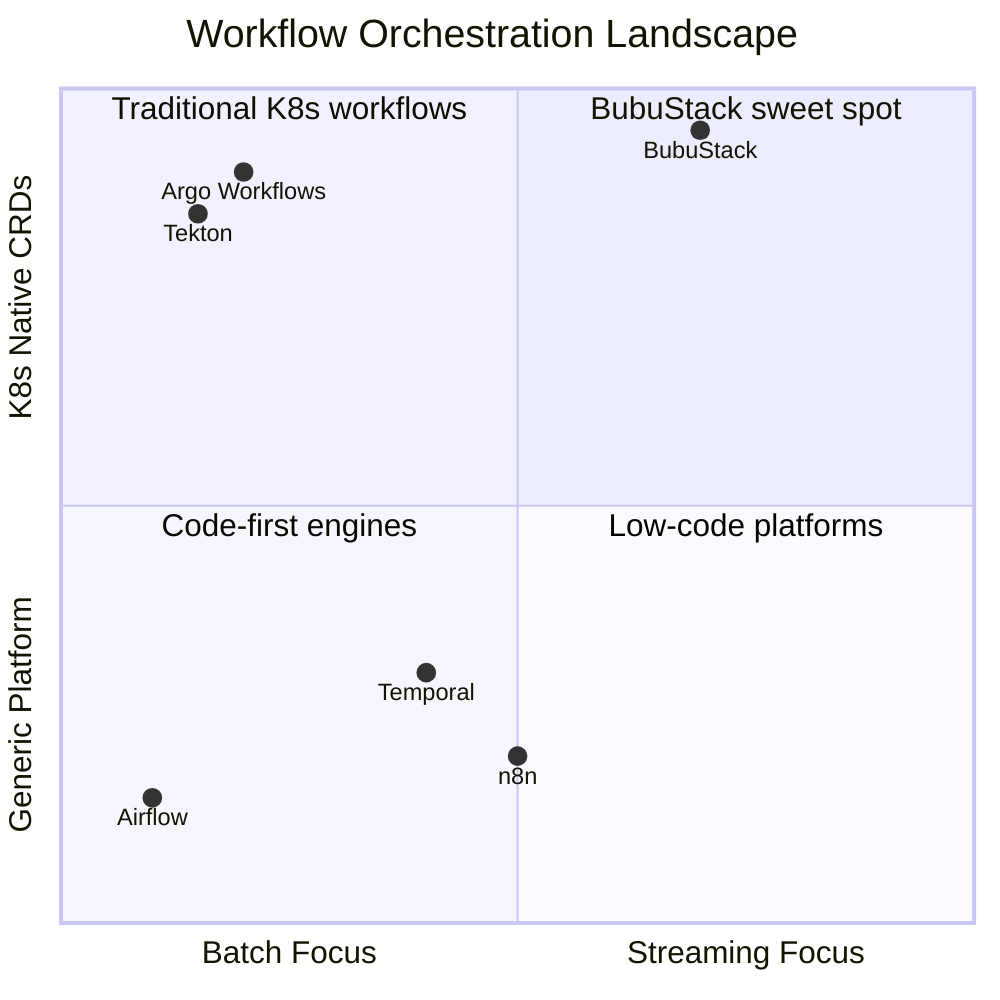

# How BubuStack Compares

:::info Quick scan
- **Why**: Understand where BubuStack fits in the workflow orchestration landscape.
- **When**: Use this guide when evaluating automation platforms for your Kubernetes infrastructure.
- **How**: Review the comparison tables and decide which features matter most for your use case.
:::

BubuStack occupies a unique position: **Kubernetes-native workflow orchestration with first-class AI/LLM support and real-time streaming capabilities**. This page compares BubuStack to established alternatives so you can make an informed decision.

## At a Glance



## Detailed Comparison

### Argo Workflows

The closest Kubernetes-native alternative. CNCF Graduated project with massive adoption.

| Aspect | Argo Workflows | BubuStack |
|--------|---------------|-----------|
| **K8s Native** | ✅ Workflows, WorkflowTemplates | ✅ Stories, Engrams, Impulses |
| **Batch Mode** | ✅ Primary focus | ✅ Fully supported |
| **Streaming Mode** | ❌ Not supported | ✅ gRPC streaming via Bobravoz |
| **AI/LLM Native** | ❌ No built-in support | ✅ First-class Engram templates |
| **Triggers** | Requires Argo Events (separate) | ✅ Impulses (built-in) |
| **Reusable Components** | WorkflowTemplates | EngramTemplates + Engrams |
| **Maturity** | ⭐⭐⭐⭐⭐ CNCF Graduated | ⭐⭐ Early stage |

**Choose Argo when:** You need battle-tested CI/CD pipelines and don't require streaming or AI primitives.

**Choose BubuStack when:** You need real-time AI pipelines, streaming data processing, or unified triggers.

---

### Temporal

Durable execution engine used by Uber, Netflix, Stripe, and Snap.

| Aspect | Temporal | BubuStack |
|--------|----------|-----------|
| **K8s Native CRDs** | ❌ Runs on K8s but uses its own APIs | ✅ Native CRDs, GitOps-friendly |
| **Durability** | ✅ Industry-leading replay | ✅ StoryRun/StepRun status tracking |
| **Language SDKs** | Go, Java, Python, TypeScript | Go (more coming) |
| **Learning Curve** | High (code-first, workflow-as-code) | Medium (YAML + SDK) |
| **Scaling** | Manual cluster management | ✅ K8s-native autoscaling |
| **Maturity** | ⭐⭐⭐⭐⭐ Enterprise proven | ⭐⭐ Early stage |

**Choose Temporal when:** You need proven durability at massive scale with code-first workflows.

**Choose BubuStack when:** You want K8s-native CRDs, declarative YAML definitions, and AI-first design.

---

### Tekton

CNCF project focused on CI/CD pipelines for Kubernetes.

| Aspect | Tekton | BubuStack |
|--------|--------|-----------|
| **Focus** | CI/CD pipelines | General automation + AI |
| **K8s Native** | ✅ Tasks, Pipelines, Triggers | ✅ Stories, Engrams, Impulses |
| **Streaming** | ❌ Not supported | ✅ Real-time via Bobravoz |
| **AI Integration** | ❌ None | ✅ First-class support |
| **Use Cases** | Build, test, deploy | Any workflow + AI pipelines |

**Choose Tekton when:** Your primary use case is CI/CD and you want CNCF-backed tooling.

**Choose BubuStack when:** You need general-purpose automation beyond CI/CD, especially AI workloads.

---

### n8n

Open-source visual workflow automation, often self-hosted.

| Aspect | n8n | BubuStack |
|--------|-----|-----------|
| **K8s Native** | ❌ Runs on K8s but not CRD-based | ✅ Native operator + CRDs |
| **User Interface** | ✅ Visual drag-and-drop | ❌ YAML/code only |
| **Target User** | Non-developers, ops teams | DevOps, Platform engineers |
| **RBAC** | Basic built-in | ✅ Kubernetes RBAC |
| **Scaling** | Manual | ✅ K8s-native autoscaling |
| **GitOps** | Limited | ✅ First-class support |

**Choose n8n when:** Your team prefers visual editors and doesn't need K8s-native integration.

**Choose BubuStack when:** You're a platform team that wants GitOps, K8s RBAC, and infrastructure-as-code.

---

### Apache Airflow

The de facto standard for data pipeline orchestration.

| Aspect | Airflow | BubuStack |
|--------|---------|-----------|
| **K8s Native** | ❌ KubernetesExecutor, but not CRD-based | ✅ Native CRDs |
| **Language** | Python DAGs | YAML + Go SDK |
| **Streaming** | ❌ Batch only | ✅ Real-time streaming |
| **AI/LLM** | ❌ No native support | ✅ First-class Engrams |
| **Scheduler** | ✅ Sophisticated | ✅ Via Impulses |
| **Maturity** | ⭐⭐⭐⭐⭐ Industry standard | ⭐⭐ Early stage |

**Choose Airflow when:** You have Python-heavy data engineering teams and need proven batch orchestration.

**Choose BubuStack when:** You want K8s-native CRDs, streaming support, and AI-first design.

---

### Dify

Open-source LLMOps platform for building AI applications.

| Aspect | Dify | BubuStack |
|--------|------|-----------|
| **Focus** | LLM apps, RAG, agents | General automation + AI |
| **K8s Native** | ❌ Runs on K8s but not CRD-based | ✅ Native operator |
| **Workflow Engine** | ✅ Visual builder | ✅ YAML Stories |
| **Non-AI Tasks** | Limited | ✅ HTTP, MCP, custom Engrams |
| **GitOps** | Limited | ✅ First-class support |

**Choose Dify when:** Your focus is purely on LLM applications with visual workflow building.

**Choose BubuStack when:** You need to mix AI with non-AI tasks in K8s-native, GitOps workflows.

---

## Feature Matrix

| Feature | BubuStack | Argo | Temporal | Tekton | n8n | Airflow |
|---------|-----------|------|----------|--------|-----|---------|
| K8s CRDs | ✅ | ✅ | ❌ | ✅ | ❌ | ❌ |
| Batch Mode | ✅ | ✅ | ✅ | ✅ | ✅ | ✅ |
| Streaming Mode | ✅ | ❌ | ❌ | ❌ | ❌ | ❌ |
| AI/LLM Native | ✅ | ❌ | ❌ | ❌ | ❌ | ❌ |
| Built-in Triggers | ✅ | ❌* | ✅ | ✅ | ✅ | ✅ |
| Visual UI | ❌ | ❌ | ❌ | ❌ | ✅ | ✅ |
| GitOps Native | ✅ | ✅ | ❌ | ✅ | ❌ | ❌ |
| CNCF/Enterprise | ❌ | ✅ | ✅ | ✅ | ❌ | ✅ |

*Argo requires separate Argo Events installation

---

## When to Choose BubuStack

### ✅ BubuStack is a great fit when you need:

- **Kubernetes-native automation** with CRDs, RBAC, and GitOps
- **Real-time streaming workflows** (audio, video, live data)
- **AI/LLM pipelines** as first-class citizens
- **Unified triggers** (cron, webhooks, events) without separate components
- **Platform engineering** patterns with reusable templates

### ❌ Consider alternatives when you need:

- **Battle-tested production reliability** → Argo Workflows, Temporal
- **Visual drag-and-drop UI** → n8n, Make, Zapier
- **Python-native data engineering** → Apache Airflow
- **Pure CI/CD focus** → Tekton, Argo Workflows
- **Enterprise support contracts today** → Temporal, Airflow (Astronomer)

---

## Migration Paths

### From Argo Workflows

```yaml
# Argo WorkflowTemplate → BubuStack EngramTemplate
# Argo Workflow → BubuStack Story
# Argo Events → BubuStack Impulses
```

Key differences:
- Engrams are more granular than Argo templates (single container vs multi-step)
- Stories support streaming mode natively
- Impulses combine triggers into the core platform

### From Airflow

```yaml
# Airflow DAG → BubuStack Story
# Airflow Operator → BubuStack Engram
# Airflow Sensor → BubuStack Impulse
```

Key differences:
- YAML instead of Python
- K8s-native instead of Celery/Kubernetes executor
- Streaming mode available

---

## Community & Support

| Platform | License | Community | Enterprise Support |
|----------|---------|-----------|-------------------|
| BubuStack | Apache 2.0 | GitHub, Discord | Coming soon |
| Argo | Apache 2.0 | CNCF, Slack | Akuity, Codefresh |
| Temporal | MIT (core) | Slack, Forum | Temporal Inc. |
| Tekton | Apache 2.0 | CNCF, Slack | Red Hat, Google |
| n8n | Fair-code | Forum, Discord | n8n GmbH |
| Airflow | Apache 2.0 | ASF, Slack | Astronomer |

---

## Next Steps

- [Install BubuStack](../operator/quickstart.md) to try it yourself
- [Explore the architecture](./architecture.md) for technical deep-dives
- [Join the community](../community/get-involved.md) to share feedback
