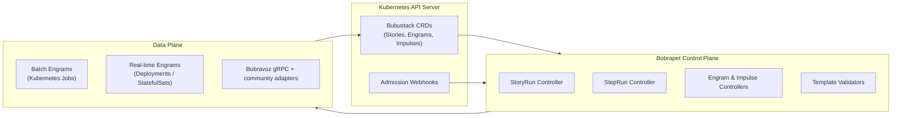

# Architecture

:::info Quick scan
- **Why**: See how the Bobrapet operator, Engrams, and transports assemble into the Bubustack ecosystem.
- **When**: Review this before planning deployments or debugging interactions between controllers and transports.
- **How**: Follow the diagrams and breakdowns of CRDs, controllers, and data plane responsibilities.
:::

Bubustack extends Kubernetes with a workflow-savvy control plane and a highly composable data plane.
Instead of building a bespoke scheduler, the Bobrapet operator leverages the platform you already
trust—Kubernetes—and adds targeted controllers, CRDs, and SDKs to orchestrate automated Stories at
scale. Additional Bubustack components—such as Bobravoz for gRPC transport and community-contributed
connectors—reuse the same declarative foundations.

## High-level View

## Custom Resource Definitions

Bobrapet introduces a suite of CRDs to represent workflows, work units, triggers, and runtime
executions:

- **Story** — Declarative DAG describing the business logic.
- **Engram** — Instantiated execution unit created from an EngramTemplate.
- **Impulse** — Trigger that materializes StoryRuns (cron, webhook, event bus, etc.).
- **StoryRun** — Runtime representation of a Story execution. Drives StepRun creation.
- **StepRun** — Tracks the lifecycle of an individual step in a StoryRun.
- **EngramTemplate / ImpulseTemplate** — Cluster-scoped blueprints with validation schemas,
  capabilities, and metadata.

These resources are versioned and compatible with GitOps tooling. Admission webhooks validate
manifest shape to catch errors before they hit the control loop.

## Controllers

Bobrapet ships with several controllers that reconcile the CRDs into the desired cluster state.
They follow the same checkbox-style pattern so you only expand the ones you need to inspect.

  

    
    
      <strong>StoryRun controller</strong>
      <small>Dependency planner & status fan-in</small>
    
  

  

    

      Evaluates Story definitions, computes dependency graphs, and dynamically creates StepRuns as
      soon as upstream steps resolve. Emits rich Kubernetes events and OpenTelemetry spans so GitOps
      pipelines can gate promotions on real-time status.
    

  

  

    
    
      <strong>StepRun controller</strong>
      <small>Runtime orchestration</small>
    
  

  

    

      Creates Kubernetes Jobs for batch Engrams or manages Deployments/StatefulSets for always-on
      runtimes, wiring in transports, secrets, and scaling hints per template. Watches pod health,
      retries failures with CEL-backed policies, and patches status objects with structured outputs.
    

  

  

    
    
      <strong>Engram & Impulse controllers</strong>
      <small>Infrastructure lifecycles</small>
    
  

  

    

      Reconcile Deployments, Services, CronJobs, or event listeners declared in templates. They
      attach policy packs for network policy, Pod Security, and quota alignment so long-lived assets
      remain compliant even as templates evolve.
    

  

  

    
    
      <strong>Template validators</strong>
      <small>Admission & governance</small>
    
  

  

    

      Admission-style controllers lint EngramTemplate and ImpulseTemplate submissions, enforce
      schema constraints, and block unsafe capabilities before the control loop reacts. Results feed
      GitHub status checks so catalog maintainers catch issues in pull requests.
    

  

All controllers communicate via the Kubernetes API server; no bespoke queues or databases are
required, which keeps Bubustack compatible with your existing GitOps workflow engines.

## Data Plane

The control plane is only half of the story. The data plane—the Engram pods—executes your code. Each
Engram receives a shared context with inputs, metadata, the configured transport (Bobravoz gRPC
today), and the addresses of downstream peers. The Go SDK (and future language SDKs contributed by
the community) handles:

- Fetching Story inputs and step outputs.
- Patching StepRun status with structured results.
- Streaming logs and metrics.
- Opening secure channels to downstream Engrams via Bobravoz gRPC today, with pluggable connectors
  arriving as contributors implement them.

Depending on the Engram mode you choose, the controller provisions either Kubernetes Jobs for batch
workloads or Deployments/StatefulSets with Services for real-time flows. Transport operators run
alongside these workloads and stay declarative so Stories are portable.

## Telemetry & Observability

Bubustack leans on OpenTelemetry semantics. Controllers emit structured events, while Engrams expose
counters, histograms, and traces. Operators can plug existing stacks (Prometheus, Tempo, Loki,
Datadog, etc.) without adapters. Audit trails capture every StoryRun, including who triggered it,
input payloads (with redaction policies), and step-by-step results.

## Multi-Tenancy

- Namespaces provide workload isolation.
- ServiceAccounts and RBAC rules scope access to Stories and Engrams.
- Pod Security admission ensures Engrams run with the expected security context.
- ResourceQuotas and LimitRanges keep noisy neighbors in check.

## Next steps

- Deep dive into [Stories](../stories/overview.md) to see how the declarative DAG works.
- Explore [Engrams](../engrams/overview.md) to learn how reusable building blocks are packaged.
- Jump to the [Go SDK reference](../sdk/go-sdk.md) to understand the runtime contract.
