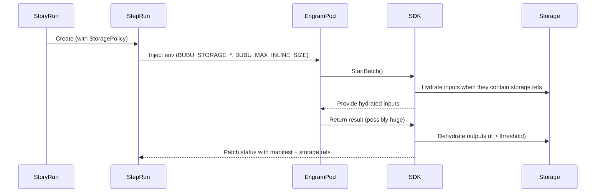

# Storage Architecture in the Bubu Platform

This note describes how storage offloading flows through the main Bubu components—`bobrapet`, `bubu-sdk-go`, `bobravoz-grpc`, and the optional storage backends (SeaweedFS, Garage, MinIO, Amazon S3).

## Why storage offloading exists

- Kubernetes `apiserver`/`etcd` reject objects over ~1.5 MiB.
- AI/MCP payloads can easily exceed this size (JSON arrays, embeddings, images).
- Persisting large blobs inline slows reconcilers and bloats cluster backups.

To keep workflow metadata lean, the SDK hydrates large inputs before an Engram runs and dehydrates large outputs afterwards. The controller only stores a lightweight reference.

## Data flow

## Supported backends

| Backend | Where to use it | Configuration tips |
|---------|-----------------|--------------------|
| **Amazon S3** | Cloud deployments | IAM roles for Service Accounts (IRSA) or access keys in secrets. |
| **SeaweedFS** | Lightweight clusters needing distributed storage | Enable the SeaweedFS S3 gateway (`weed server -s3`), set `BUBU_STORAGE_S3_ENDPOINT=http://seaweedfs-s3.<ns>.svc:8333`. Buckets map to Seaweed collections. |
| **Garage** | Edge or on-prem environments needing replication | Configure Garage buckets per namespace. Use service tokens or basic auth; set `BUBU_STORAGE_S3_ENDPOINT`. |
| **MinIO** | Local development and CI | Point `BUBU_STORAGE_S3_ENDPOINT` at `http://minio.<ns>.svc:9000` and mount credentials from a secret. |
| **File provider** | Unit tests / single-node dev clusters | `BUBU_STORAGE_PROVIDER=file`, `BUBU_STORAGE_FILE_PATH=/tmp/bubu`. Not recommended for multi-node or production. |

All S3-compatible backends share the same configuration surface (bucket, endpoint, access key/secret). Because the SDK uses the official AWS Go SDK, features like TLS, path-style addressing, and session tokens work transparently.

## Controller defaults

- `BUBU_MAX_INLINE_SIZE=1024` (1 KiB) keeps StepRun statuses tiny.
- `BUBU_MAX_RECURSION_DEPTH=64` prevents runaway hydration loops even with deeply nested MCP responses.
- `BUBU_STORAGE_TIMEOUT=300s` protects long uploads and downloads from hanging indefinitely.
- `StoragePolicy` can be set cluster-wide via the operator ConfigMap or per Story.

## Choosing a backend

| Use case | Recommendation |
|----------|----------------|
| Production in AWS | Amazon S3 with IRSA and SSE (server-side encryption). |
| Production in other clouds | SeaweedFS or Garage for self-managed, MinIO for managed equivalents. |
| Local development | MinIO (single container) or file provider. |

## Operational guidance

- Keep bucket prefixes scoped per namespace or Story to simplify retention policies.
- Enable lifecycle rules (e.g., delete after N days) for short-lived artifacts.
- Monitor hydration/dehydration metrics (`bubu_storage_hydration_seconds`, etc.) to detect latency spikes.
- When using SeaweedFS or Garage, deploy them with persistence (PVCs) and replication suited to your workload.

## Related docs

- [Storage offloading guide](../sdk/storage-offloading.md)
- [Large payload how-to](../howto/handle-large-payloads.md)
- [SDK user guide](../sdk/sdk-user-guide.md#storage-offloading)
