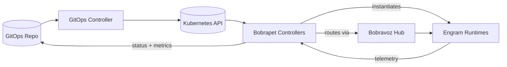

# Meet the Bubustack Ecosystem

:::info Quick scan
- **Why**: Align founders, operators, and contributors on how Bubustack composes AI automation using Kubernetes-native, infrastructure-as-code patterns.
- **When**: Use this overview before defining your first Story, EngramTemplate, or transport integration.
- **How**: Follow the lexicon, lifecycle diagram, and product surface links to explore the ecosystem in depth.
:::

Bubustack is the automation ecosystem for teams who want the reliability of cloud platform tooling
with the pace of modern AI stacks. The **Bobrapet** operator extends Kubernetes with reusable
**Engrams**, declarative **Stories**, event-driven **Impulses**, and pluggable transports like
**Bobravoz gRPC** (available today) with additional transports contributed as community demand
appears. Everything is described as code, reviewed like infrastructure, and enforced by
Kubernetes-grade safety rails. Instead of trading control for visual tooling or brittle scripting,
Bubustack keeps builders in declarative manifests, packages LLM-heavy pipelines as reusable Engrams,
and invites contributions in the open so the platform evolves with the community.

> **Big idea:** *Automate like an SRE, compose like a product squad, and ship with community-first
> momentum.*

## Reveal the Bubustack ecosystem only when you need it

The community is actively iterating on multiple surfaces, so the deep dives below are tucked behind
checkbox-style toggles. Pop them open when you are ready; otherwise the high-level narrative stays
focused.

  

    
    
      <strong>Bobrapet operator</strong>
      <small>Control plane & IaC lifecycles</small>
    
  

  

    <ul>
      <li>Ships StoryRun + StepRun controllers, admission checks, and telemetry surfaces.</li>
      <li>Applies standard Kubernetes manifests so Argo CD, Flux, or Faros can reconcile it.</li>
      <li>Handles primitives (parallelism, loops, waits) without hiding anything behind UIs.</li>
    </ul>
    
<a href="/docs/operator/quickstart">Follow the operator quickstart →</a>

  

  

    
    
      <strong>Engrams</strong>
      <small>Reusable AI/data building blocks</small>
    
  

  

    <ul>
      <li>Templates encode schema, runtime type, and required transports behind a durable ABI.</li>
      <li>SDKs provide scaffolds (Go today; additional languages arrive when contributors ship them) with telemetry baked in.</li>
      <li>Catalog governance keeps semantic versions compatible across namespaces and clusters.</li>
    </ul>
    
<a href="/docs/engrams/authoring">Read the Engram authoring guide →</a>

  

  

    
    
      <strong>Stories & Impulses</strong>
      <small>DAG definitions and triggers</small>
    
  

  

    <ul>
      <li>Stories are declarative DAGs with CEL expressions for guards, branching, and templating.</li>
      <li>Impulses translate cron, webhooks, or custom events into new StoryRuns.</li>
      <li>StoryRuns surface replayable telemetry, policy violations, and promotion history.</li>
    </ul>
    
<a href="/docs/stories/overview">Dive into Stories and Primitives →</a>

  

  

    
    
      <strong>Transports</strong>
      <small>Bobravoz today, community adapters next</small>
    
  

  

    <ul>
      <li>Bobravoz gRPC is production-ready today with tracing, retries, and encryption.</li>
      <li>New adapters reuse the same manifest knobs when maintainers contribute them.</li>
      <li>Stories can mix transports per step, letting you graduate workloads gradually.</li>
    </ul>
    
<a href="/docs/transports/overview">Review the transport overview →</a>

  

## Why Different Teams Love It

- **Founders & product leaders** keep a single narrative: Engrams are modular product capabilities,
  Stories are customer-facing journeys, and the community backlog stays transparent through GitOps.
- **Platform operators** rely on native RBAC, observability, and runtime policies while Bobrapet
  handles dependency graphs, rollouts, and transport wiring.
- **Contributors & partners** publish Engrams, Story templates, and transport adapters into a public
  catalog that stays compatible thanks to a stable ABI and SDK contracts.

## How Bubustack Stands Apart

- **GitOps-native from day one** — No hidden UIs. Every Story, EngramTemplate, and Impulse travels
  through pull requests with reviewable diffs, unlike low-code builders where state drifts
  silently.
- **LLM modularity without rewrites** — Engrams encapsulate language models, retrieval, evaluation,
  and guardrails as versioned templates so you design pipelines once and reuse them everywhere.
- **Transport optionality baked in** — Bobravoz gRPC is production-ready; new adapters reuse the same spec when community members contribute them, so you can plan migrations without rewrites.
- **Open, GitOps-native backlog** — Working groups publish transport, SDK, and catalog ideas in the same repos you deploy, keeping founders and operators aligned on what ships next.

## Core Building Blocks

| Component | Role in the ecosystem | Delivered by | Learn more |
| --- | --- | --- | --- |
| **Story** | Declarative DAG that composes Engrams, Impulses, and Primitives into a flow. | Bobrapet CRD (`bubustack.io`) | [Stories overview](stories/overview.md) |
| **StoryRun** | Runtime execution record with telemetry for every step. | Bobrapet controllers | [Story telemetry](stories/patterns.md#inspect-storyruns) |
| **Engram** | Reusable execution unit packaged as a container with a strict runtime ABI. | EngramTemplates + SDK toolchain | [Engram overview](engrams/overview.md) |
| **Impulse** | Trigger that instantiates a StoryRun from events, cron, or custom controllers. | ImpulseTemplates + transports | [Impulses guide](stories/impulses.md) |
| **Primitive** | Built-in control flow (`condition`, `loop`, `parallel`, `wait`, etc.). | Bobrapet primitive catalog | [Primitive library](stories/primitives.md) |
| **Transport** | Pluggable data plane that links Engrams across the mesh. | Bobravoz gRPC today | [Transport overview](transports/overview.md) |

## Declarative Delivery Lifecycle

1. **Declare** Stories, EngramTemplates, Impulses, and transport policies in Git.
2. **Promote** through GitOps controllers (Argo CD, Flux, Faros) into clusters.
3. **Reconcile** with Bobrapet controllers that materialize runtimes and orchestrate StepRuns.
4. **Transport** data with Bobravoz gRPC today—future transports reuse the same declarative spec when submitted by the community.
5. **Observe** StoryRuns via Prometheus metrics, structured logs, OpenTelemetry traces, and the
   Bobrapet status surface.

## What You Can Launch Today

- Retrieval-augmented generation (RAG) pipelines that mix vector search, tool use, and guardrails.
- Back-office automations wired into CRM, finance, or support systems with deterministic branching.
- Real-time inference meshes that connect streaming sources to GPU-backed Engrams over Bobravoz.
- AI assistants that call production systems through Engram templates with stable, audited APIs.

## Community Signals to Watch

- **Transports**: Bobravoz is production-ready; proposed adapters live on the community board until
  contributors implement and stabilize them.
- **SDKs**: Go is GA; requests for additional languages progress based on community demand and
  contribution capacity.
- **Catalog governance**: The Engram working group publishes weekly reviews to keep template ABI
  compatibility intact and surface security attestations.

## Navigate the Documentation

- Start operating with the [Bobrapet Quickstart](operator/quickstart.md).
- Go deep on architecture in [Ecosystem Architecture](ecosystem/architecture.md).
- Author reusable components via [Engram Patterns](engrams/overview.md) and the
  [Engram Authoring Guide](engrams/authoring.md).
- Design declarative workflows in [Stories & Primitives](stories/overview.md).
- Wire data planes through [Transport Integrations](transports/overview.md).
- Extend the stack with the [Go SDK](sdk/go-sdk.md) and [API Reference](reference/api-reference.md).
- Follow the community board through the [Community & Contribution guide](community/get-involved.md).

## Next steps

- [Install Bobrapet](operator/quickstart.md) to run your first Story end-to-end.
- [Study the architecture](ecosystem/architecture.md) for control-plane internals.
- [Share requests on the community board](community/get-involved.md#working-groups) to align working
  groups and deployments.
