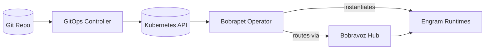

# BubuStack Overview

BubuStack applies the Unix philosophy to workflow orchestration on Kubernetes.

## Design philosophy

1. **Do one thing and do it well.** Each Engram is a single-purpose component —
   transcribe audio, call an LLM, send a notification. It does its job and
   produces output. It knows nothing about the pipeline it runs in.

2. **Write programs to work together.** A Story composes Engrams into a DAG,
   wiring step outputs to step inputs. Swap one Engram for another and the
   pipeline keeps working — just as replacing `jq` with `yq` in a shell
   pipeline requires no changes to the surrounding commands.

3. **Text is the universal interface.** Step outputs are JSON. Templates
   evaluate against a shared context of `inputs` and `steps`. There is no
   proprietary IPC, no binary coupling — just structured data flowing between
   independent components.

The operator ([bobrapet](https://github.com/bubustack/bobrapet)) is the **kernel**: it schedules, reconciles, and enforces
policy. It never owns business logic. The components — [Engrams](https://github.com/orgs/bubustack/repositories?q=engram) and [Impulses](https://github.com/orgs/bubustack/repositories?q=impulse) — are
**userspace**: Engrams own side effects, external calls, and data transformation; Impulses listen for external events and trigger workflows.
The SDK ([bubu-sdk-go](https://github.com/bubustack/bubu-sdk-go)) is **libc**: it provides the contract between the two.

## Core resources

| Resource | Scope | Purpose |
| --- | --- | --- |
| **Story** | Namespaced | Declarative workflow definition (DAG of steps, policies, schemas) |
| **StoryTrigger** | Namespaced | Durable admission request for external trigger delivery |
| **StoryRun** | Namespaced | Concrete execution of a Story with resolved inputs/outputs |
| **StepRun** | Namespaced | Execution record for a single step within a StoryRun |
| **EffectClaim** | Namespaced | Durable reservation and completion authority for one step side effect |
| **Engram** | Namespaced | Configured component instance |
| **EngramTemplate** | Cluster | Component definition with schemas and runtime contract |
| **Impulse** | Namespaced | Trigger that submits `StoryTrigger` requests from external events |
| **ImpulseTemplate** | Cluster | Trigger definition |
| **Transport** | Cluster | Streaming transport provider configuration |
| **TransportBinding** | Namespaced | Runtime binding between a step and its transport connector |

## Module map

| Module | Role |
| --- | --- |
| [`tractatus`](https://github.com/bubustack/tractatus) | Protobuf service definitions for gRPC transport |
| [`core`](https://github.com/bubustack/core) | Shared contracts, templating engine, transport protocol/env helpers, and connector runtime helpers |
| [`bobrapet`](https://github.com/bubustack/bobrapet) | Kubernetes operator: CRDs, controllers, webhooks |
| [`bubu-sdk-go`](https://github.com/bubustack/bubu-sdk-go) | Go SDK for building Engrams and Impulses |
| [`bobravoz-grpc`](https://github.com/bubustack/bobravoz-grpc) | gRPC streaming transport hub |
| [`bubuilder`](https://github.com/bubustack/bubuilder) | Web console and API server |
| [`bubu-registry`](https://github.com/bubustack/bubu-registry) | Git-backed component registry and `bubu` CLI |
| [`engrams/*`](https://github.com/orgs/bubustack/repositories?q=engram) | Individual Engram implementations |
| [`impulses/*`](https://github.com/orgs/bubustack/repositories?q=impulse) | Individual Impulse implementations |

Dependencies form a strict DAG — lower layers never import higher layers.

## Delivery lifecycle

1. **Declare** Stories, EngramTemplates, and Impulses in Git.
2. **Apply** with your GitOps controller (Argo CD, Flux, or plain kubectl).
3. **Reconcile** — Bobrapet creates runtimes, wires transports, schedules steps.
4. **Observe** — StoryRuns emit OpenTelemetry traces, structured errors, and metrics.

## Choose your path

### I am an operator

1. [Prerequisites](getting-started/prerequisites.md)
2. [Quickstart](getting-started/quickstart.md)
3. [Operator Configuration](operator/configuration.md)
4. [Observability](observability/overview.md)

### I am building components

1. [Go SDK](sdk/go-sdk.md)
2. [Building Engrams & Impulses](sdk/building-engrams.md)
3. [Runtime Primitives](runtime/primitives.md)

### I want to contribute

1. [Community](community/get-involved.md)
2. [Roadmap](community/roadmap.md)
3. [Examples repository](https://github.com/bubustack/examples)

## Quick routes

- **Getting started**: [Prerequisites](getting-started/prerequisites.md), [Quickstart](getting-started/quickstart.md)
- **Building components**: [Building Engrams & Impulses](sdk/building-engrams.md), [Go SDK](sdk/go-sdk.md), [Component Ecosystem](overview/component-ecosystem.md)
- **Browse components**: [Engrams on GitHub](https://github.com/orgs/bubustack/repositories?q=engram), [Impulses on GitHub](https://github.com/orgs/bubustack/repositories?q=impulse)
- **Operating the platform**: [Operator Configuration](operator/configuration.md), [Lifecycle](runtime/lifecycle.md), [Observability](observability/overview.md)
- **Streaming**: [Streaming Contract](streaming/streaming-contract.md), [Transport Settings](streaming/transport-settings.md), [Lifecycle Hooks](streaming/lifecycle-hooks.md)
- **API design**: [CRD Design](api/crd-design.md), [Scoping](api/scoping.md), [Errors](api/errors.md)
- **Community**: [Get Involved](community/get-involved.md), [Roadmap](community/roadmap.md)
