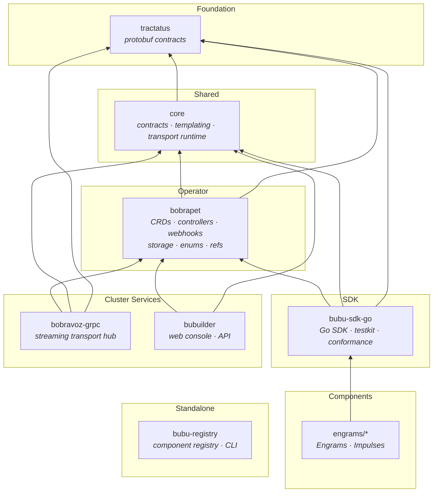
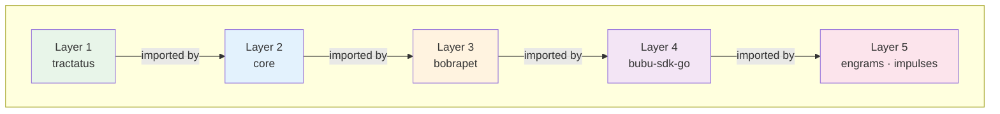
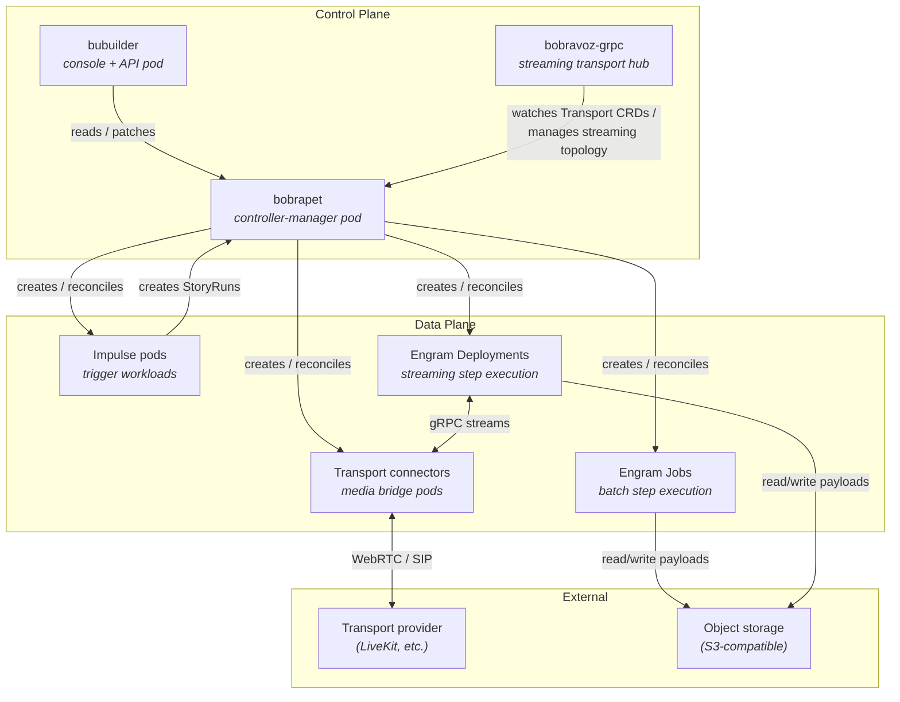

# System Architecture

This document describes the overall BubuStack system design: the module
structure, dependency rules, and how the pieces fit together from protobuf
contracts to user-facing components.

## Who this is for

- New contributors who need a system-level map.
- Platform engineers evaluating the dependency graph.
- Component authors choosing which modules to import.

## What you'll get

- The layered module architecture and its invariants.
- Mermaid diagrams of the dependency graph and runtime topology.
- Clear rules for what depends on what and why.

---

## Design principles

1. **Strict linear dependencies.** Modules form a DAG with no cycles. Lower
   layers never import higher layers.
2. **Separation of concerns.** Protocol definitions, shared logic, operator
   internals, SDK surface, and components live in distinct modules.
3. **Operator is the kernel.** [bobrapet](https://github.com/bubustack/bobrapet)
   owns CRDs, controllers, and runtime packages. Everything above it consumes
   its API types but never its controller internals.
4. **SDK is the component boundary.** [Engrams](https://github.com/orgs/bubustack/repositories?q=engram)
   and [Impulses](https://github.com/orgs/bubustack/repositories?q=impulse)
   depend on [bubu-sdk-go](https://github.com/bubustack/bubu-sdk-go), not on
   bobrapet internals.
5. **No circular dependencies.** Enforced by Go module boundaries and verified
   by CI.

---

## Module map

BubuStack comprises multiple independent Go modules, each with its own `go.mod`.

| Module | Purpose | Scope |
| --- | --- | --- |
| [tractatus](https://github.com/bubustack/tractatus) | Protobuf service and message definitions for gRPC transport. | Cluster |
| [core](https://github.com/bubustack/core) | Shared runtime contracts, templating engine, transport connector runtime, identity helpers. | Cluster |
| [bobrapet](https://github.com/bubustack/bobrapet) | Kubernetes operator: CRDs, controllers, webhooks, config resolver, storage client, enums, refs. | Cluster |
| [bubu-sdk-go](https://github.com/bubustack/bubu-sdk-go) | Go SDK for building Engrams and Impulses. Testkit, conformance suites, K8s client helpers. | Component |
| [bobravoz-grpc](https://github.com/bubustack/bobravoz-grpc) | Streaming transport operator: gRPC hub, transport topology analysis, connector lifecycle. | Cluster |
| [bubuilder](https://github.com/bubustack/bubuilder) | Web console and API server for managing Stories, Runs, and observability. | Cluster |
| bubu-registry *(planned)* | Git-backed component registry and `bubu` CLI for publishing templates. See [Roadmap](../community/roadmap.md). | Standalone |
| [engrams/*](https://github.com/orgs/bubustack/repositories?q=engram) | Individual Engram implementations (batch and streaming data processors). | Component |
| [impulses/*](https://github.com/orgs/bubustack/repositories?q=impulse) | Individual Impulse implementations (event-driven workflow triggers). | Component |
| [helm-charts](https://github.com/bubustack/helm-charts) | Helm charts for deploying BubuStack. | Deployment |
| [examples](https://github.com/bubustack/examples) | Sample Stories and workflows. | Documentation |

---

## Dependency graph

Dependencies flow strictly upward. Lower modules have zero knowledge of
higher modules.



---

## Layer rules



| Rule | Description |
| --- | --- |
| Layer N may only import layers < N | Prevents cycles. `core` can import `tractatus` but never `bobrapet`. |
| Satellite services ([bobravoz-grpc](https://github.com/bubustack/bobravoz-grpc), [bubuilder](https://github.com/bubustack/bubuilder)) sit at Layer 4 | They import `bobrapet` and `core` but never each other or the SDK. |
| Engrams and Impulses import [bubu-sdk-go](https://github.com/bubustack/bubu-sdk-go) as their primary dependency | Direct `bobrapet` imports are discouraged; use the SDK re-exports. |
| `bubu-registry` is standalone | Zero bubustack module dependencies. |

---

## What each layer provides

### Layer 1: [tractatus](https://github.com/bubustack/tractatus) (protobuf contracts)

Defines the gRPC service definitions and message types used by streaming
transport connectors. All proto-generated Go code lives here so that higher
layers share the same wire types without regenerating.

- `tractatus/proto/` — `.proto` source files.
- `tractatus/gen/` — Generated Go stubs.

No bubustack dependencies. Only depends on `google.golang.org/grpc` and
`google.golang.org/protobuf`.

### Layer 2: [core](https://github.com/bubustack/core) (shared runtime)

Provides cross-cutting utilities consumed by both the operator and the SDK:

- `core/contracts` — Environment variable names, label keys, annotation keys,
  and structured constants shared between controllers and SDKs.
- `core/templating` — Go template + Sprig.
- `core/runtime/transport` — Transport connector runtime and codec negotiation.
- `core/runtime/identity` — Deterministic identity derivation for runs.
- `core/runtime/featuretoggles` — Feature toggle helpers.

Depends only on [tractatus](https://github.com/bubustack/tractatus).

### Layer 3: [bobrapet](https://github.com/bubustack/bobrapet) (operator)

The Kubernetes operator that owns the CRD lifecycle:

- `bobrapet/api/` — CRD type definitions across API groups (`bubustack.io`,
  `catalog.bubustack.io`, `runs.bubustack.io`, `transport.bubustack.io`,
  `policy.bubustack.io`).
- `bobrapet/internal/controller/` — Reconcilers for all CRDs.
- `bobrapet/internal/config/` — Policy resolver (merges operator defaults →
  template → story → step → steprun overrides).
- `bobrapet/pkg/` — Shared packages consumed by higher layers: `storage`,
  `enums`, `refs`, `conditions`, `runs/identity`, `templating`, `metrics`.
- `bobrapet/internal/webhook/` — Admission and defaulting webhooks.

Depends on [core](https://github.com/bubustack/core) and
[tractatus](https://github.com/bubustack/tractatus).

See [CRD Design](../api/crd-design.md) for the full resource model and
[Operator Configuration](../operator/configuration.md) for configuration keys.

### Layer 4: [bubu-sdk-go](https://github.com/bubustack/bubu-sdk-go) (SDK)

The public Go SDK for building Engrams and Impulses:

- **Batch execution** — `sdk.StartBatch[C, I]` for finite tasks running as
  Kubernetes Jobs.
- **Streaming execution** — `sdk.StartStreaming[C]` for continuous processing
  with gRPC bidirectional streaming.
- **Impulse execution** — `sdk.RunImpulse[C]` for long-running triggers that
  create StoryRuns from external events.
- Schema validation (input/output against EngramTemplate/ImpulseTemplate schemas).
- Effect tracking and signal replay.
- Transport connector integration.
- K8s client for StepRun status patching, trigger delivery, and transport
  binding.
- `testkit/` — Local harness for component tests (`testkit.BatchHarness`,
  `testkit.StreamHarness`).
- `conformance/` — Contract test suites (`conformance.BatchSuite`,
  `conformance.StreamSuite`).

Depends on [bobrapet](https://github.com/bubustack/bobrapet) (API types + `pkg/*`),
[core](https://github.com/bubustack/core), and
[tractatus](https://github.com/bubustack/tractatus).

See [Go SDK](../sdk/go-sdk.md) and [Building Engrams](../sdk/building-engrams.md)
for usage guides.

### Layer 5: engrams and impulses (components)

Individual Engram and Impulse implementations. Each is its own Go module with
its own repository.

**Engrams** process data — they receive inputs, execute logic, and produce
outputs. They run as either Kubernetes Jobs (batch) or Deployments (streaming).

| Category | Components |
| --- | --- |
| Batch engrams | [http-request-engram](https://github.com/bubustack/http-request-engram), [json-filter-engram](https://github.com/bubustack/json-filter-engram), [map-reduce-adapter-engram](https://github.com/bubustack/map-reduce-adapter-engram), [materialize-engram](https://github.com/bubustack/materialize-engram) |
| Streaming engrams | [openai-stt-engram](https://github.com/bubustack/openai-stt-engram), [openai-tts-engram](https://github.com/bubustack/openai-tts-engram), [openai-chat-engram](https://github.com/bubustack/openai-chat-engram), [silero-vad-engram](https://github.com/bubustack/silero-vad-engram), [livekit-bridge-engram](https://github.com/bubustack/livekit-bridge-engram), [livekit-turn-detector-engram](https://github.com/bubustack/livekit-turn-detector-engram), [mcp-adapter-engram](https://github.com/bubustack/mcp-adapter-engram) |

**Impulses** trigger workflows — they listen for external events (webhooks,
cron schedules, Kubernetes events) and create StoryRuns via the SDK.

| Component | Trigger source |
| --- | --- |
| [cron-impulse](https://github.com/bubustack/cron-impulse) | Cron schedules |
| [github-webhook-impulse](https://github.com/bubustack/github-webhook-impulse) | GitHub webhook events (PRs, pushes, issues) |
| [kubernetes-impulse](https://github.com/bubustack/kubernetes-impulse) | Kubernetes resource events (pod crashes, deployments, etc.) |
| [livekit-webhook-impulse](https://github.com/bubustack/livekit-webhook-impulse) | LiveKit room and participant events |

Primary dependency: [bubu-sdk-go](https://github.com/bubustack/bubu-sdk-go).

Browse all components:
[Engrams](https://github.com/orgs/bubustack/repositories?q=engram) ·
[Impulses](https://github.com/orgs/bubustack/repositories?q=impulse)

---

## Cluster services

### [bobravoz-grpc](https://github.com/bubustack/bobravoz-grpc) (streaming transport operator)

Manages the real-time streaming data plane for BubuStack. It analyzes Story
definitions to configure optimal transport topologies:

- **Peer-to-Peer (P2P)** — Direct engram-to-engram gRPC connections for
  maximum throughput when no intermediate processing is needed.
- **Hub-and-Spoke** — Data routed through the operator's gRPC hub to execute
  Story primitives in-flight (backpressure, flow control, routing).

The operator runs an embedded gRPC hub server and manages lightweight
[connector](https://github.com/bubustack/bobravoz-grpc) sidecars alongside
streaming workloads.

See [Streaming Contract](../streaming/streaming-contract.md) and
[Transport Settings](../streaming/transport-settings.md) for configuration.

### [bubuilder](https://github.com/bubustack/bubuilder) (web console)

Web console and REST API for operators and workflow authors. Provides
visibility into StoryRuns, StepRuns, Jobs, logs, offloaded storage, and
observability data.

---

## Runtime topology

At runtime the modules map to Kubernetes workloads:



### Control plane

- **[bobrapet](https://github.com/bubustack/bobrapet)** runs as a single
  controller-manager Deployment. It reconciles all CRDs, resolves policies,
  creates workloads, and manages the DAG.
- **[bobravoz-grpc](https://github.com/bubustack/bobravoz-grpc)** watches
  Transport and TransportBinding CRDs to configure the streaming data plane.
  It analyzes Story step graphs, determines optimal topology (P2P vs
  hub-and-spoke), and injects transport bindings into streaming workloads.
- **[bubuilder](https://github.com/bubustack/bubuilder)** serves the web
  console and REST API for operators and workflow authors.

### Data plane

- **Impulse pods** run trigger workloads (Deployments) that receive external
  events — webhooks, cron ticks, Kubernetes watch events — and create
  StoryRuns via the SDK (`sdk.RunImpulse`).
- **Engram Jobs** execute batch steps as Kubernetes Jobs. The operator creates
  one Job per StepRun and monitors exit codes, retries, and outputs.
- **Engram Deployments** execute streaming steps as long-lived Deployments.
  They connect to transport connectors for real-time data streaming.
- **Transport connectors** bridge between streaming Engrams and external
  transport providers (e.g., LiveKit for real-time audio/video). Managed by
  [bobravoz-grpc](https://github.com/bubustack/bobravoz-grpc).

---

## Import rules for component authors

When building an Engram or Impulse, follow these import guidelines:

```
PREFER:  github.com/bubustack/bubu-sdk-go/...
         github.com/bubustack/core/contracts
         github.com/bubustack/tractatus/...

AVOID:   github.com/bubustack/bobrapet/pkg/...     (use SDK re-exports)
         github.com/bubustack/bobrapet/api/...      (use SDK K8s client)

NEVER:   github.com/bubustack/bobrapet/internal/... (private to operator)
         github.com/bubustack/bobravoz-grpc/...
         github.com/bubustack/bubuilder/...
```

If you need a type or helper from `bobrapet/pkg/*` that the SDK doesn't
re-export, [file an issue](https://github.com/bubustack/bubu-sdk-go/issues) to
add it to the SDK rather than importing the operator directly.

---

## Related docs

- [Core](core.md) — Workflow model and execution flow.
- [Component Ecosystem](component-ecosystem.md) — SDK usage, component contracts, and the catalog.
- [CRD Design](../api/crd-design.md) — CRD resource model and relationships.
- [Go SDK](../sdk/go-sdk.md) — SDK entry points and usage patterns.
- [Building Engrams](../sdk/building-engrams.md) — Step-by-step guide for building components.
- [Streaming Contract](../streaming/streaming-contract.md) — Streaming message rules and data flow.
- [Transport Settings](../streaming/transport-settings.md) — Backpressure, routing, and replay configuration.
- [Operator Configuration](../operator/configuration.md) — Operator configuration keys and defaults.
- [Quickstart](../getting-started/quickstart.md) — Get running in under 10 minutes.
- [Roadmap](../community/roadmap.md) — What's planned and where to contribute.
