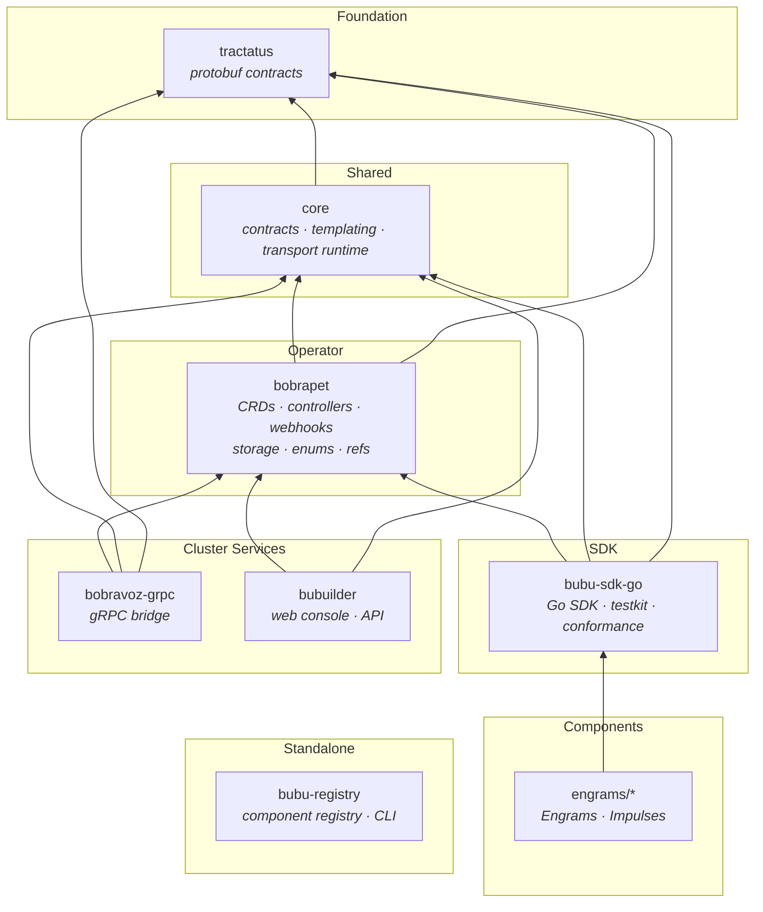
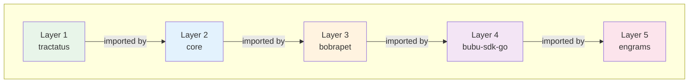
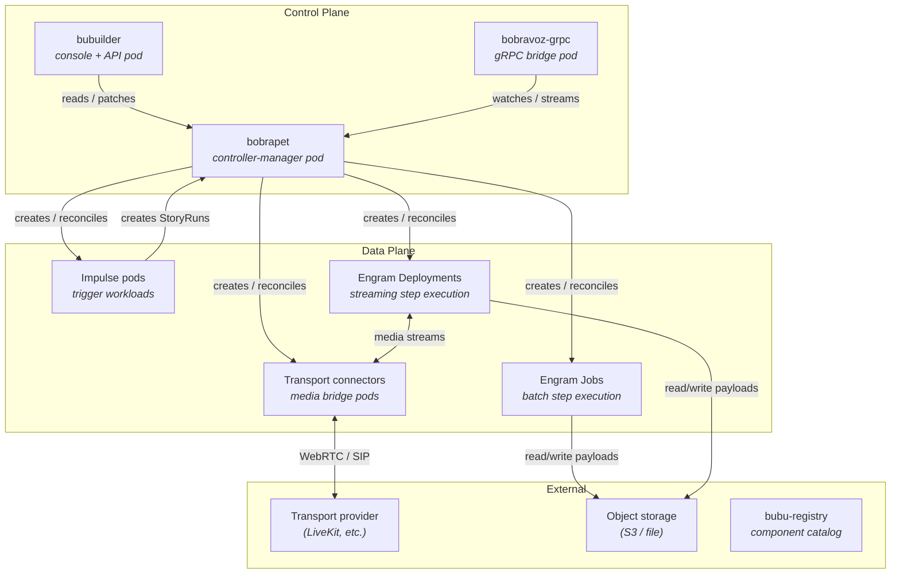

# System Architecture

This document describes the overall BubuStack system design: the module
structure, dependency rules, and how the pieces fit together from protobuf
contracts to user-facing components.

## Who this is for

- New contributors who need a system-level map.
- Platform engineers evaluating the dependency graph.
- Component authors choosing which modules to import.

## What you'll get

- The layered module architecture and its invariants.
- Mermaid diagrams of the dependency graph and runtime topology.
- Clear rules for what depends on what and why.

---

## Design principles

1. **Strict linear dependencies.** Modules form a DAG with no cycles. Lower
   layers never import higher layers.
2. **Separation of concerns.** Protocol definitions, shared logic, operator
   internals, SDK surface, and components live in distinct modules.
3. **Operator is the spine.** `bobrapet` owns CRDs, controllers, and runtime
   packages. Everything above it consumes its API types but never its
   controller internals.
4. **SDK is the component boundary.** Engrams and Impulses should depend on
   `bubu-sdk-go`, not on `bobrapet` internals.
5. **No circular dependencies.** Enforced by Go module boundaries and verified
   by CI.

---

## Module map

BubuStack is a multi-module Go monorepo. Each directory is an independent
Go module with its own `go.mod`.

| Module | Purpose | Scope |
| --- | --- | --- |
| `tractatus` | Protobuf service and message definitions for gRPC transport. | Cluster |
| `core` | Shared runtime contracts, templating engine, transport connector runtime, identity helpers. | Cluster |
| `bobrapet` | Kubernetes operator: CRDs, controllers, webhooks, config resolver, storage client, enums, refs. | Cluster |
| `bubu-sdk-go` | Go SDK for building Engrams and Impulses. Testkit, conformance suites, K8s client helpers. | Component |
| `bobravoz-grpc` | gRPC server bridging Kubernetes resources to external gRPC clients. | Cluster |
| `bubuilder` | Web console and API server for managing Stories, Runs, and observability. | Cluster |
| `bubu-registry` | Git-backed component registry and `bubu` CLI for publishing templates. | Standalone |
| `engrams/*` | Individual Engram and Impulse implementations (batch and streaming). | Component |
| `helm-charts` | Helm charts for deploying BubuStack. | Deployment |
| `examples` | Sample Stories and workflows. | Documentation |

---

## Dependency graph

Dependencies flow strictly upward. Lower modules have zero knowledge of
higher modules.



---

## Layer rules



| Rule | Description |
| --- | --- |
| Layer N may only import layers < N | Prevents cycles. `core` can import `tractatus` but never `bobrapet`. |
| Satellite services (bobravoz-grpc, bubuilder) sit at Layer 4 | They import `bobrapet` and `core` but never each other or the SDK. |
| Engrams import `bubu-sdk-go` as their primary dependency | Direct `bobrapet` imports are discouraged; use the SDK re-exports. |
| `bubu-registry` is standalone | Zero bubustack module dependencies. |

---

## What each layer provides

### Layer 1: tractatus (protobuf contracts)

Defines the gRPC service definitions and message types used by streaming
transport connectors. All proto-generated Go code lives here so that higher
layers share the same wire types without regenerating.

- `tractatus/proto/` — `.proto` source files.
- `tractatus/gen/` — Generated Go stubs.

No bubustack dependencies. Only depends on `google.golang.org/grpc` and
`google.golang.org/protobuf`.

### Layer 2: core (shared runtime)

Provides cross-cutting utilities consumed by both the operator and the SDK:

- `core/contracts` — Environment variable names, label keys, annotation keys,
  and structured constants shared between controllers and SDKs.
- `core/templating` — Go template + Sprig.
- `core/runtime/transport` — Transport connector runtime and codec negotiation.
- `core/runtime/identity` — Deterministic identity derivation for runs.
- `core/runtime/featuretoggles` — Feature toggle helpers.

Depends only on `tractatus`.

### Layer 3: bobrapet (operator)

The Kubernetes operator that owns the CRD lifecycle:

- `bobrapet/api/` — CRD type definitions across API groups (`bubustack.io`,
  `catalog.bubustack.io`, `runs.bubustack.io`, `transport.bubustack.io`,
  `policy.bubustack.io`).
- `bobrapet/internal/controller/` — Reconcilers for all CRDs.
- `bobrapet/internal/config/` — Policy resolver (merges operator defaults →
  template → story → step → steprun overrides).
- `bobrapet/pkg/` — Shared packages consumed by higher layers: `storage`,
  `enums`, `refs`, `conditions`, `runs/identity`, `templating`, `metrics`.
- `bobrapet/internal/webhook/` — Admission and defaulting webhooks.

Depends on `core` and `tractatus`.

### Layer 4: bubu-sdk-go (SDK)

The public Go SDK for building Engrams and Impulses:

- Batch and streaming execution helpers.
- Schema validation (input/output against `EngramTemplate` schemas).
- Effect tracking and signal replay.
- Transport connector integration.
- K8s client for StepRun status patching, trigger delivery, and transport
  binding.
- `testkit/` — Local harness for component tests.
- `conformance/` — Contract test suites.

Depends on `bobrapet` (API types + `pkg/*`), `core`, and `tractatus`.

### Layer 5: engrams (components)

Individual Engram and Impulse implementations. Each is its own Go module:

| Category | Examples |
| --- | --- |
| Batch engrams | `http-request-engram`, `json-filter-engram`, `map-reduce-adapter-engram`, `materialize-engram` |
| Streaming engrams | `openai-stt-engram`, `openai-tts-engram`, `openai-chat-engram`, `silero-vad-engram`, `livekit-agent-engram`, `livekit-turn-detector-engram`, `mcp-adapter-engram` |
| Impulses | `cron-impulse`, `github-webhook-impulse`, `kubernetes-impulse`, `livekit-webhook-impulse` |

Primary dependency: `bubu-sdk-go`.

---

## Runtime topology

At runtime the modules map to Kubernetes workloads:



### Control plane

- **bobrapet** runs as a single controller-manager Deployment. It reconciles
  all CRDs, resolves policies, creates workloads, and manages the DAG.
- **bobravoz-grpc** provides a gRPC API for external systems to watch and
  interact with Stories, Runs, and Steps.
- **bubuilder** serves the web console and REST API for operators and workflow
  authors.

### Data plane

- **Impulse pods** run trigger workloads (Deployments or StatefulSets) that
  receive external events and create StoryRuns via the SDK.
- **Engram Jobs** execute batch steps as Kubernetes Jobs. The operator creates
  one Job per StepRun and monitors exit codes, retries, and outputs.
- **Engram Deployments** execute streaming steps as long-lived Deployments.
  They connect to transport connectors for media streaming.
- **Transport connectors** bridge between Engrams and external transport
  providers (e.g., LiveKit for real-time audio/video).

---

## Import rules for component authors

When building an Engram or Impulse, follow these import guidelines:

```
PREFER:  github.com/bubustack/bubu-sdk-go/...
         github.com/bubustack/core/contracts
         github.com/bubustack/tractatus/...

AVOID:   github.com/bubustack/bobrapet/pkg/...     (use SDK re-exports)
         github.com/bubustack/bobrapet/api/...      (use SDK K8s client)

NEVER:   github.com/bubustack/bobrapet/internal/... (private to operator)
         github.com/bubustack/bobravoz-grpc/...
         github.com/bubustack/bubuilder/...
```

If you need a type or helper from `bobrapet/pkg/*` that the SDK doesn't
re-export, file an issue to add it to the SDK rather than importing the
operator directly.

---

## Related docs

- `/docs/overview/core.md` — Workflow model and execution flow.
- `/docs/overview/component-ecosystem.md` — SDK usage and component contracts.
- `/docs/api/crd-design.md` — CRD resource model and relationships.
- `/docs/operator/configuration.md` — Operator configuration keys and defaults.
