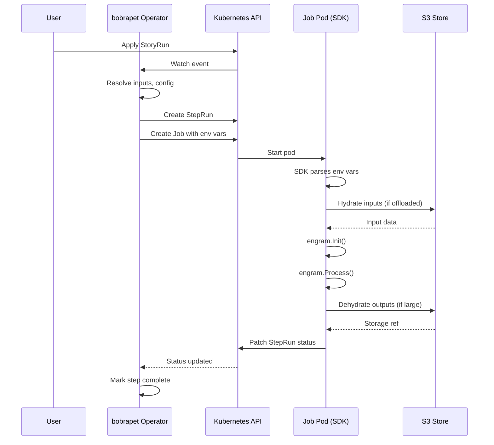
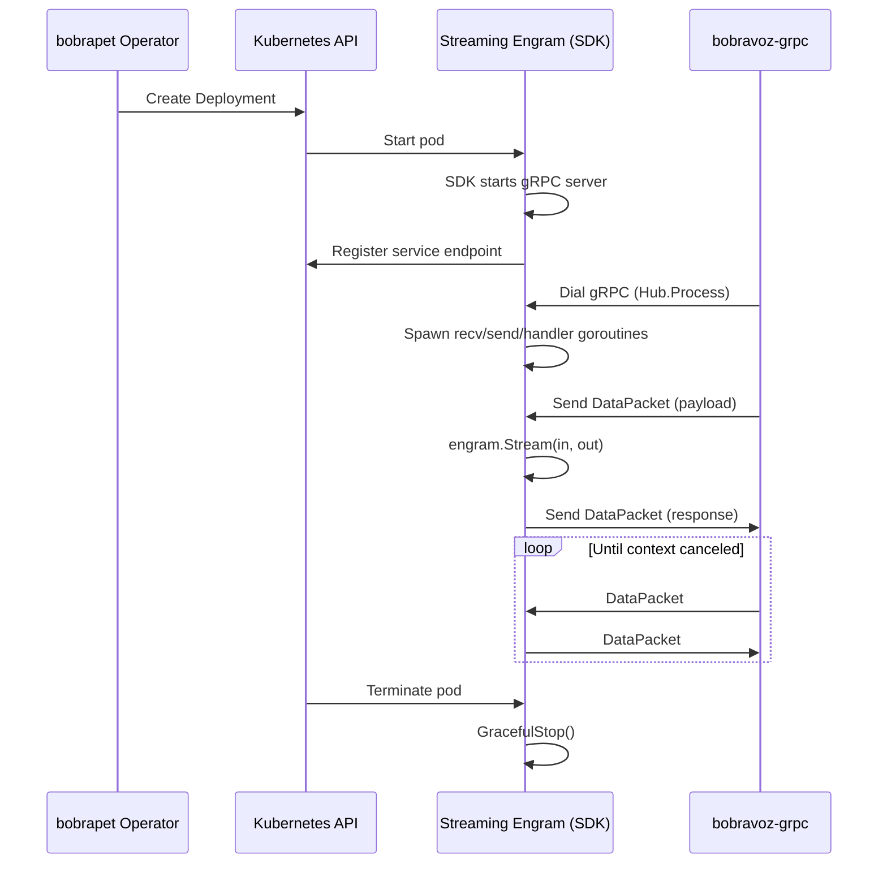

# bubu-sdk-go: Integration Guide

How the SDK integrates with bobrapet operator and bobravoz-grpc transport.

---

## Architecture Overview

```
┌─────────────────────────────────────────────────────────────────┐
│ Kubernetes Cluster                                               │
│                                                                  │
│  ┌──────────────────┐                                           │
│  │ bobrapet         │  Watches CRDs, manages lifecycle          │
│  │ (Operator)       │                                           │
│  └────────┬─────────┘                                           │
│           │ Creates Pods                                        │
│           │ Injects Env Vars                                    │
│           ▼                                                     │
│  ┌──────────────────┐         ┌──────────────────┐            │
│  │ Batch Engram     │         │ Streaming Engram │            │
│  │ (Job)            │         │ (Deployment)     │            │
│  │                  │         │                  │            │
│  │ ┌──────────────┐ │         │ ┌──────────────┐ │            │
│  │ │  SDK Runtime │ │         │ │  SDK Runtime │ │            │
│  │ │  (bubu-sdk)  │ │         │ │  + gRPC Srv  │ │            │
│  │ └──────────────┘ │         │ └──────┬───────┘ │            │
│  └──────────────────┘         └────────┼─────────┘            │
│                                         │                       │
│                                         │ gRPC Stream           │
│                                         ▼                       │
│                             ┌────────────────────┐             │
│                             │ bobravoz-grpc      │             │
│                             │ (Transport Hub)    │             │
│                             └────────────────────┘             │
│                                                                  │
└─────────────────────────────────────────────────────────────────┘
```

---

## Operator → SDK Contracts

### 1. Environment Variables

**Operator Code:** `bobrapet/internal/controller/runs/steprun_controller.go:363-373`

**Batch Jobs:**
```go
envVars := []corev1.EnvVar{
    {Name: "BUBU_STORY_NAME", Value: story.Name},
    {Name: "BUBU_STORYRUN_ID", Value: srun.Spec.StoryRunRef.Name},
    {Name: "BUBU_STEP_NAME", Value: srun.Spec.StepID},
    {Name: "BUBU_STEPRUN_NAME", Value: srun.Name},
    {Name: "BUBU_STEPRUN_NAMESPACE", Value: srun.Namespace},
    {Name: "BUBU_INPUTS", Value: string(inputBytes)},  // JSON
    {Name: "BUBU_EXECUTION_MODE", Value: "batch"},
    {Name: "BUBU_GRPC_PORT", Value: fmt.Sprintf("%d", defaultGRPCPort)},
    {Name: "BUBU_MAX_INLINE_SIZE", Value: fmt.Sprintf("%d", defaultMaxInlineSize)},
    // + BUBU_CONFIG_*, BUBU_SECRET_*, BUBU_STORAGE_*
}
```

**SDK Usage:** `runtime/context.go:29-74`

**✅ Contract Validated:** All vars consumed by SDK.

**🔴 Missing:** `BUBU_STARTED_AT` (SDK falls back to `metav1.Now()`; should be injected for accurate duration).

---

### 2. CRD → Pod Spec Mapping

**Engram CRD:**
```yaml
apiVersion: bubustack.io/v1alpha1
kind: Engram
metadata:
  name: my-engram
spec:
  image: my-registry/my-engram:latest
  with:
    timeout: 30s
    retries: 3
  secretRefs:
    - name: api-credentials
      key: API_KEY
```

**Operator Transforms To:**
```yaml
apiVersion: batch/v1
kind: Job
metadata:
  name: my-engram-steprun-xyz
spec:
  template:
    spec:
      containers:
      - name: engram
        image: my-registry/my-engram:latest
        env:
          - name: BUBU_CONFIG_timeout
            value: "30s"
          - name: BUBU_CONFIG_retries
            value: "3"
          - name: BUBU_SECRET_API_KEY
            value: "file:/var/secrets/api-credentials"
        volumeMounts:
          - name: secret-api-credentials
            mountPath: /var/secrets/api-credentials
            readOnly: true
      volumes:
        - name: secret-api-credentials
          secret:
            secretName: api-credentials
```

**SDK Consumes:**
```go
type Config struct {
    Timeout time.Duration `mapstructure:"timeout"`
    Retries int           `mapstructure:"retries"`
}

func (e *MyEngram) Init(ctx context.Context, cfg Config, secrets *sdk.Secrets) error {
    apiKey, _ := secrets.Get("API_KEY")  // Reads /var/secrets/api-credentials/<key>
    // ...
}
```

---

### 3. RBAC Requirements

**SDK Needs:**
- `storyruns.create` (for `sdk.StartStory`)
- `stepruns.get`, `stepruns/status.patch` (for status updates)

**Operator Provisions:**
```yaml
apiVersion: rbac.authorization.k8s.io/v1
kind: Role
metadata:
  name: engram-role
  namespace: default
rules:
  - apiGroups: ["runs.bubustack.io"]
    resources: ["storyruns"]
    verbs: ["create", "get"]
  - apiGroups: ["runs.bubustack.io"]
    resources: ["stepruns"]
    verbs: ["get"]
  - apiGroups: ["runs.bubustack.io"]
    resources: ["stepruns/status"]
    verbs: ["patch"]
---
apiVersion: v1
kind: ServiceAccount
metadata:
  name: engram-sa
---
apiVersion: rbac.authorization.k8s.io/v1
kind: RoleBinding
metadata:
  name: engram-rolebinding
roleRef:
  apiGroup: rbac.authorization.k8s.io
  kind: Role
  name: engram-role
subjects:
  - kind: ServiceAccount
    name: engram-sa
```

**Operator Sets:**
```yaml
spec:
  template:
    spec:
      serviceAccountName: engram-sa
```

**✅ SDK Uses:** `k8s/client.go:41-57` (in-cluster config with SA token)

---

### 4. Storage Configuration

**Story CRD:**
```yaml
apiVersion: bubustack.io/v1alpha1
kind: Story
metadata:
  name: data-pipeline
spec:
  storage:
    s3:
      bucket: my-bucket
      region: us-west-2
      endpoint: https://s3.us-west-2.amazonaws.com
      authentication:
        secretRef:
          name: aws-credentials
```

**Operator Injects:**
```go
envVars = append(envVars,
    corev1.EnvVar{Name: "BUBU_STORAGE_PROVIDER", Value: "s3"},
    corev1.EnvVar{Name: "BUBU_STORAGE_S3_BUCKET", Value: "my-bucket"},
    corev1.EnvVar{Name: "BUBU_STORAGE_S3_REGION", Value: "us-west-2"},
    corev1.EnvVar{Name: "BUBU_STORAGE_S3_ENDPOINT", Value: "https://..."},
)
envFromSources = append(envFromSources, corev1.EnvFromSource{
    SecretRef: &corev1.SecretEnvSource{
        LocalObjectReference: corev1.LocalObjectReference{Name: "aws-credentials"},
    },
})
```

**SDK Consumes:** `storage/s3_store.go:47-94`

**✅ Contract Validated:** SDK reads all S3 env vars.

---

## Transport → SDK Contracts

### 1. gRPC Proto Schema

**bobravoz-grpc Proto:** `bobravoz-grpc/proto/main.proto`

```protobuf
syntax = "proto3";
package proto;

service Hub {
  rpc Process (stream DataPacket) returns (stream DataPacket);
}

message DataPacket {
  map<string, string> metadata = 1;
  google.protobuf.Struct payload = 2;
}
```

**SDK Server Implementation:** `stream.go:59-132`

```go
func (s *server) Process(stream bobravozgrpcproto.Hub_ProcessServer) error {
    req, _ := stream.Recv()  // *bobravozgrpcproto.DataPacket
    payloadBytes, _ := protojson.Marshal(req.Payload)
    in <- payloadBytes  // Pass to engram
    
    // Receive from engram
    data := <-out
    payload := &structpb.Struct{}
    protojson.Unmarshal(data, payload)
    stream.Send(&bobravozgrpcproto.DataPacket{Payload: payload})
}
```

**🔴 Issue:** SDK **ignores `DataPacket.Metadata`** field, losing StoryRunID/StepName tracing.

**Recommendation:** Extend `StreamingEngram` interface to include metadata:
```go
type Message struct {
    Metadata map[string]string
    Payload  []byte
}

type StreamingEngram[C any] interface {
    Engram[C]
    Stream(ctx context.Context, in <-chan Message, out chan<- Message) error
}
```

---

### 2. Port Configuration

**Operator Sets:** `realtime_engram_controller.go:308`
```go
{Name: "BUBU_GRPC_PORT", Value: fmt.Sprintf("%d", r.ConfigResolver.GetOperatorConfig().Controller.Engram.EngramControllerConfig.DefaultGRPCPort)}
```

**Transport Expects:** Port from Service resource

**Service Created by Operator:**
```yaml
apiVersion: v1
kind: Service
metadata:
  name: my-engram
spec:
  ports:
    - port: 50051
      targetPort: grpc
      protocol: TCP
      name: grpc
  selector:
    app: my-engram
```

**SDK Binds To:** `stream.go:163-171`
```go
port := os.Getenv("BUBU_GRPC_PORT")  // "50051"
lis, _ := net.Listen("tcp", fmt.Sprintf(":%s", port))
s := grpc.NewServer(opts...)
bobravozgrpcproto.RegisterHubServer(s, &server{...})
s.Serve(lis)
```

**✅ Contract Validated:** Port alignment between operator, service, and SDK.

---

### 3. TLS Configuration (Optional)

**Operator Mounts Certs:**
```yaml
volumes:
  - name: tls-certs
    secret:
      secretName: engram-tls
volumeMounts:
  - name: tls-certs
    mountPath: /var/tls
    readOnly: true
env:
  - name: BUBU_GRPC_TLS_CERT_FILE
    value: /var/tls/tls.crt
  - name: BUBU_GRPC_TLS_KEY_FILE
    value: /var/tls/tls.key
```

**SDK Enables TLS:** `stream.go:186-194`
```go
certFile := os.Getenv("BUBU_GRPC_TLS_CERT_FILE")
keyFile := os.Getenv("BUBU_GRPC_TLS_KEY_FILE")
if certFile != "" && keyFile != "" {
    creds, _ := credentials.NewServerTLSFromFile(certFile, keyFile)
    opts = append(opts, grpc.Creds(creds))
}
```

**✅ Contract Validated:** TLS optional; works when certs provided.

---

## Health & Readiness Probes

**Operator Sets:** `realtime_engram_controller.go:312-314`
```yaml
livenessProbe:
  tcpSocket:
    port: 50051
  initialDelaySeconds: 10
readinessProbe:
  tcpSocket:
    port: 50051
  periodSeconds: 5
```

**SDK Provides:** TCP server (gRPC)

**🟧 Limitation:** No HTTP health endpoint. gRPC health service (`grpc.health.v1.Health`) not exposed.

**Recommendation:** Add SDK helper:
```go
func RegisterHealthServer(s *grpc.Server) {
    healthpb.RegisterHealthServer(s, health.NewServer())
}
```

---

## Workflow: Batch Execution



---

## Workflow: Streaming Execution



---

### Tuning gRPC (Server and Client)

You can tune message sizes, channel buffers, and per-message timeouts.

```bash
# Server
BUBU_GRPC_PORT=50051
BUBU_GRPC_MAX_RECV_BYTES=104857600   # 100 MiB
BUBU_GRPC_MAX_SEND_BYTES=104857600   # 100 MiB
BUBU_GRPC_CHANNEL_BUFFER_SIZE=32     # Buffered in/out channels
BUBU_GRPC_MESSAGE_TIMEOUT=15s        # Send/Recv timeout (server)
BUBU_GRPC_CHANNEL_SEND_TIMEOUT=5s    # Timeout to enqueue to handler when backpressured

# Client
BUBU_GRPC_CLIENT_MAX_RECV_BYTES=104857600
BUBU_GRPC_CLIENT_MAX_SEND_BYTES=104857600
BUBU_GRPC_MESSAGE_TIMEOUT=15s        # Send/Recv timeout (client)
BUBU_GRPC_DIAL_TIMEOUT=10s           # Dial timeout
```

TLS client with custom CA:

```bash
BUBU_GRPC_CLIENT_TLS=true
BUBU_GRPC_CA_FILE=/var/tls/ca.crt
```

---

## API Versioning

**Operator CRDs:**
- `bubustack.io/v1alpha1` — Current version
- `runs.bubustack.io/v1alpha1` — StoryRun, StepRun

**SDK Dependencies:**
```go
// go.mod
require (
    github.com/bubustack/bobrapet v0.0.0-20250926120003-fbd39089e093
    github.com/bubustack/bobravoz-grpc v0.0.0-20250926120155-e667792a5283
)
```

**✅ Pinned Versions:** SDK tracks operator API versions via go.mod.

**Recommendation:** Tag SDK releases with compatible operator versions:
```
v0.1.0 (operator: v0.1.x, transport: v0.1.x)
v0.2.0 (operator: v0.2.x, transport: v0.2.x)
```

---

## Breaking Change Policy

**Operator → SDK:**
- Adding new env var → **Minor** (SDK ignores unknown vars)
- Removing env var → **Major** (SDK will fail)
- Changing env var format → **Major** (e.g., JSON structure change)

**Transport → SDK:**
- Adding proto field → **Minor** (backward-compatible)
- Removing proto field → **Major** (SDK expects field)
- Changing RPC signature → **Major**

**SDK → User:**
- Adding interface method → **Major** (user must implement)
- Adding optional env var → **Minor**
- Changing function signature → **Major**

---

## Testing Integration

### Operator E2E Test (with SDK)

```yaml
# test/e2e/fixtures/simple-engram.yaml
apiVersion: bubustack.io/v1alpha1
kind: Engram
metadata:
  name: test-engram
spec:
  image: bubustack/test-engram:latest
  with:
    message: "Hello from test"
```

```go
// test/e2e/engram_test.go
func TestEngramExecution(t *testing.T) {
    // Apply Engram CRD
    // Trigger StoryRun
    // Wait for StepRun completion
    // Assert output contains "Hello from test"
}
```

### SDK Integration Test (mock operator)

```go
// sdk_test.go
func TestRunBatch_WithMockClients(t *testing.T) {
    os.Setenv("BUBU_STORY_NAME", "test-story")
    os.Setenv("BUBU_STEPRUN_NAME", "test-step")
    os.Setenv("BUBU_INPUTS", `{"key":"value"}`)
    
    mockK8s := &k8s.MockClient{}
    mockK8s.On("PatchStepRunStatus", ...).Return(nil)
    
    mockSM := &storage.MockManager{}
    mockSM.On("Hydrate", ...).Return(map[string]any{"key":"value"}, nil)
    
    err := runWithClients(context.Background(), testEngram, mockK8s, mockSM)
    assert.NoError(t, err)
}
```

---

## Troubleshooting Integration Issues

### 1. SDK can't find StepRun to patch status
**Symptom:** `failed to get StepRun 'xyz' in namespace 'default' for status patch`

**Causes:**
- Wrong namespace (check `BUBU_POD_NAMESPACE`)
- Missing RBAC (`stepruns.get` permission)
- StepRun deleted before SDK patched status

**Fix:**
```bash
kubectl get stepruns -n <namespace>
kubectl auth can-i get stepruns --as=system:serviceaccount:<namespace>:<sa-name>
```

### 2. gRPC connection refused
**Symptom:** Transport can't connect to streaming engram

**Causes:**
- Port mismatch (Service vs `BUBU_GRPC_PORT`)
- Pod not ready (crash loop)
- Network policy blocking traffic

**Fix:**
```bash
kubectl get svc my-engram -o yaml  # Check port
kubectl logs my-engram-xxx         # Check SDK startup
kubectl port-forward my-engram-xxx 50051:50051
grpcurl -plaintext localhost:50051 list  # Test connectivity
```

### 3. Metadata lost in streaming
**Symptom:** Downstream engrams can't trace StoryRunID

**Cause:** SDK ignores `DataPacket.Metadata`

**Workaround:** Encode metadata in payload:
```json
{
  "__meta__": {"storyRunId": "abc-123"},
  "data": { ... }
}
```

---

## Future Integration Points

### Planned Enhancements

1. **Metadata Support:** Parse `DataPacket.Metadata` in SDK
2. **gRPC Health:** Expose `grpc.health.v1.Health` service
3. **Metrics:** OpenTelemetry integration for K8s, gRPC, S3 metrics
4. **Admission Webhooks:** Validate Engram CRDs against SDK capabilities

---

For troubleshooting, see the [SDK Troubleshooting](./sdk-troubleshooting.md) guide.
