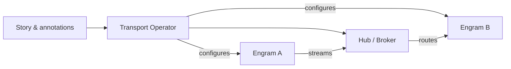

# Transport Integrations

:::info Quick scan
- **Why**: Choose the right transport to connect Engrams and enforce data-plane policy in Bubustack.
- **When**: Reference this once Stories evolve beyond pure batch workloads or need streaming guarantees.
- **How**: Compare capabilities, annotate Stories, and monitor the transport lifecycle.
:::

Transports connect Engrams in motion. They carry payloads, propagate backpressure, and apply
policy-enforced routing between Story steps. Bubustack treats transports as declarative companions
to the Bobrapet operator: you opt in through annotations and configuration on your Stories, and the
transport operator reconciles the data plane.

## Core Concepts

- **Transport operator** — Kubernetes controller + data-plane component that wires Engrams together.
- **Topology selection** — Operators inspect the Story graph to decide between peer-to-peer and
  hub-and-spoke routing.
- **Policy hooks** — Annotations on Stories and Engrams enable TLS, observability, and autoscaling
  preferences without editing application code.
- **Pluggable implementations** — Bobravoz gRPC is available today. Additional transports follow the
  same contract when community members contribute adapters.

## When Do You Need a Transport?

- You run **streaming Stories** where payloads flow continuously between Engrams.
- You need **sub-second latency** and cooperative backpressure handling.
- You want primitives like `transform`, `filter`, or `aggregate` evaluated inline without writing new
  code.
- You plan to **span clusters or network boundaries** and need a managed entry point.

For batch workloads, the default StepRun Job orchestration is sufficient—no transport required.

## Transport Feature Snapshot

| Capability                     | Bobravoz gRPC (today) |
|--------------------------------|-----------------------|
| Streaming Story support        | ✅                    |
| Hub-and-spoke topology         | ✅                    |
| Peer-to-peer topology          | ✅                    |
| CEL primitive evaluation       | ✅                    |
| Backpressure buffering         | ✅                    |
| Auto TLS between Engrams       | ✅                    |
| Cross-cluster federation       | ✅ (via mTLS)         |

## Transport Lifecycle

1. Annotate a Story with the desired transport (e.g. `bubustack.io/transport: bobravoz-grpc`).
2. Apply transport-specific configuration through `spec.transport` or Engram annotations.
3. The transport operator reconciles Services, Secrets, and config maps.
4. When StoryRuns execute, StepRuns receive transport endpoints via the SDK.
5. Metrics and health signals stream back to the control plane for observability.

## Next steps

- Dive into [Bobravoz Operations](bobravoz.md) for hands-on configuration and scaling.
- Share requests for new adapters through the community backlog.
- Feed transport learnings back into the [Day-2 operations guide](../operator/day-two-operations.md).
